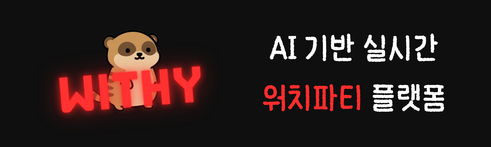
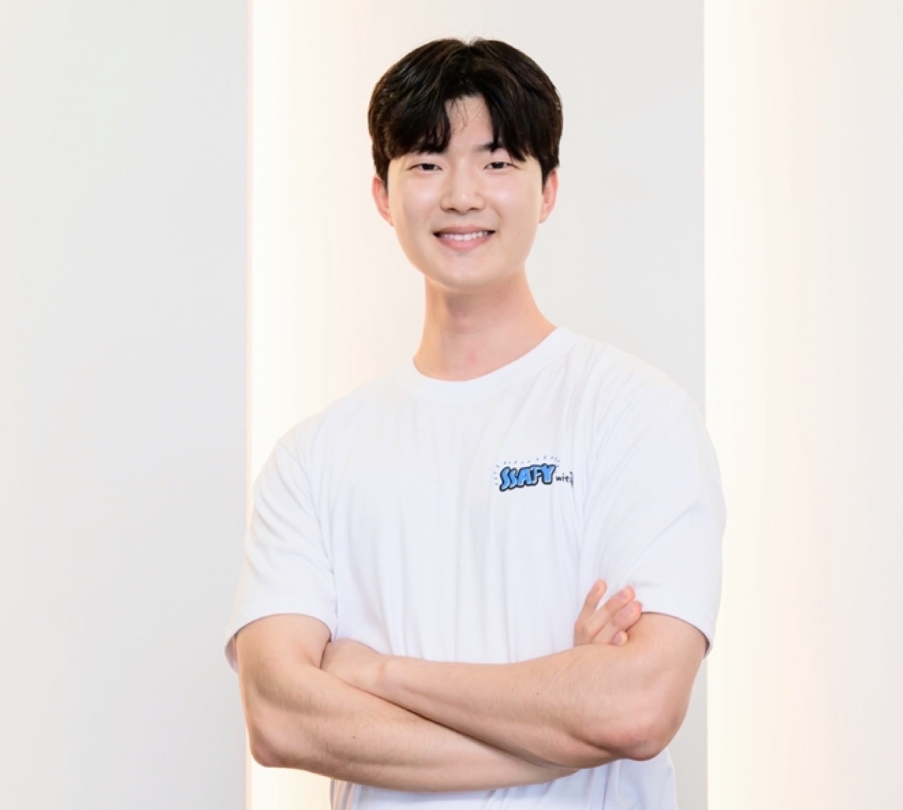
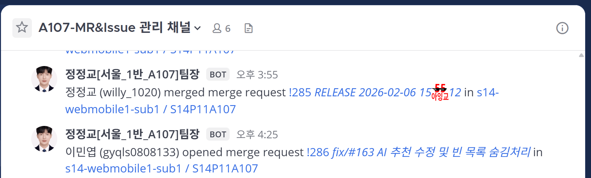
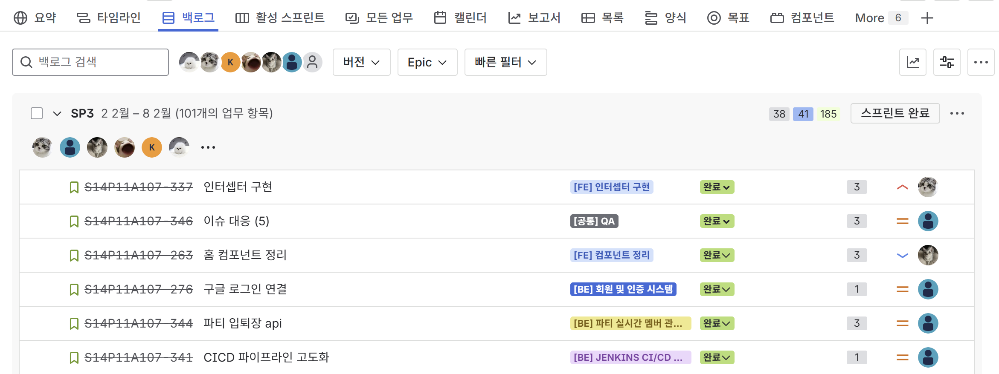
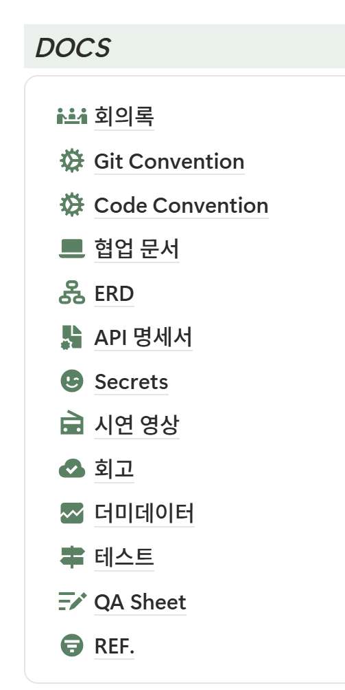
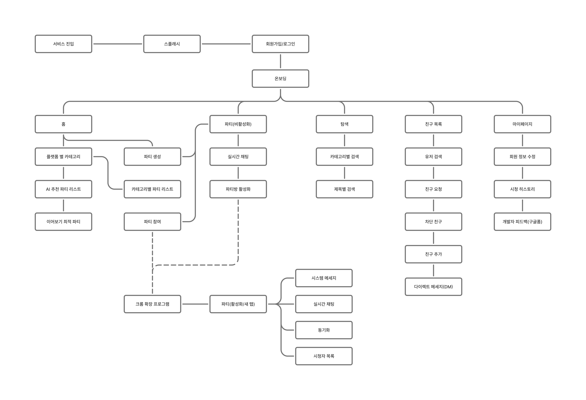
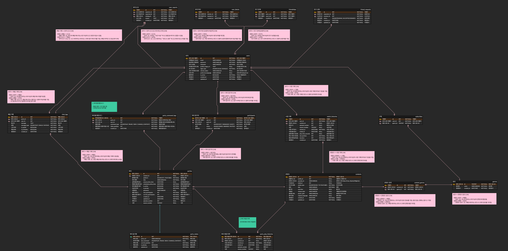
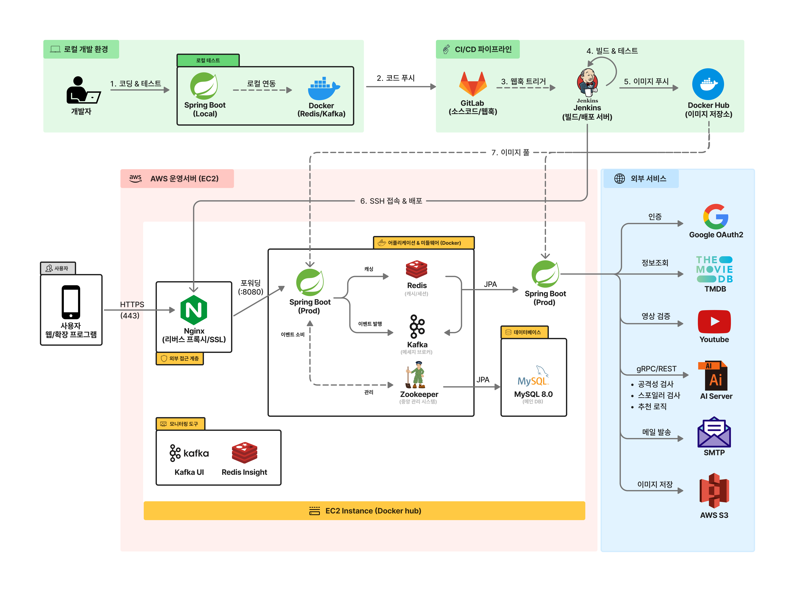
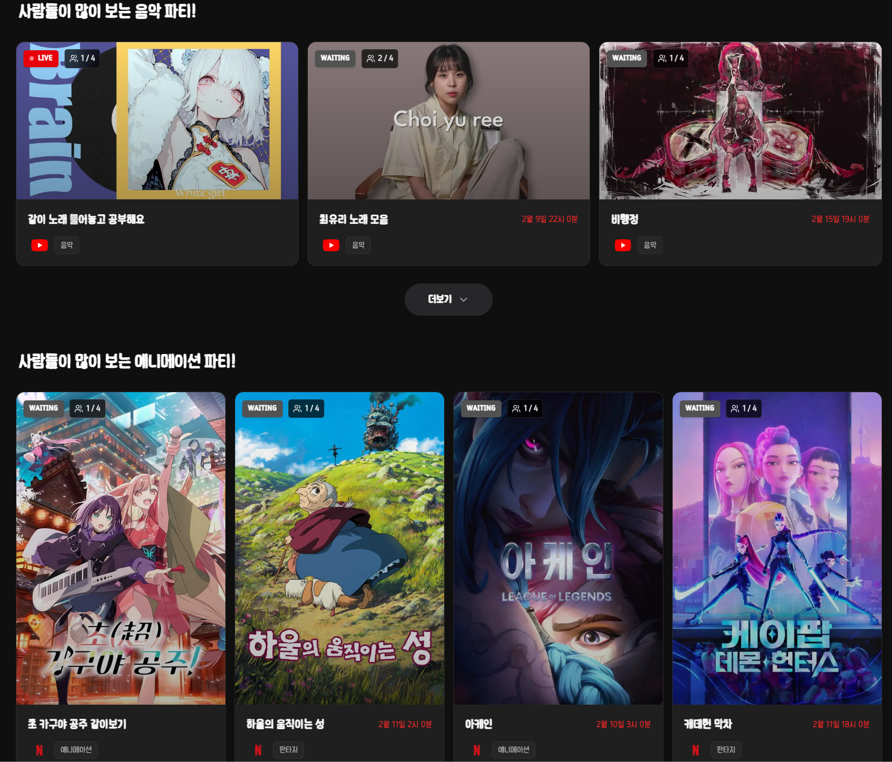

## 🎉 프로젝트 소개
> "물리적 거리가 멀어져도, **함께 즐기는 경험**은 그대로"

넷플릭스, 유튜브 화면 공유의 끊김과 저화질, 불편하지 않으셨나요? 이제 번거로운 화면 공유 툴은 끄세요.
WITHY(위디)는 영상의 **타임라인을 직접 제어하는 독자적인 동기화 기술**로 완벽한 몰입감을 선사합니다.

눈살을 찌푸리게 하는 무분별한 비난도, 중요한 반전을 스포일러 당할 일도 없습니다.
**욕설과 스포일러를 감지**하는 쾌적한 채팅 환경에서, 오직 콘텐츠와 소통에만 집중할 수 있습니다.

취향으로 연결되는 우리만의 영화관. 
서로의 이름은 몰라도, 좋아하는 장르는 아니까. 당신과 취향이 통하는 사람들과 함께하세요.

같이 보는 즐거움의 새로운 기준, **WITHY**.

---

## 🎉 프로젝트 기간
2026.01.12 ~ 2026.02.09 (5주)

---

## 🎉 주요 기능
### 1. 지능형 클린 채팅 (AI Clean Chat)
> 핵심 기술: **gRPC, Redis, Kafka, WebSocket**
- **실시간 욕설 필터링**
    - 채팅 전송 시 **gRPC 통신 기반**의 분석 모듈을 통해 유해성을 즉시 진단
    - 욕설/비속어 감지 시 메시지를 자동으로 블라인드 처리하여 쾌적한 환경 유지
- **스포일러 방지 파이프라인**
    - 대량의 채팅을 처리하기 위해 **Redis 버퍼링 → Kafka 메시지 큐 → AI 분석**의 비동기 파이프라인 구축
    - 콘텐츠의 재미를 반감시키는 스포일러성 발언을 사전에 차단
- **메시지 관리 시스템**
    - 방장/매니저 권한을 통한 메시지 관리 및 데이터 보존형 삭제(Soft Delete) 구현
### 2. 같이보기 파티 (Watch Party)
> 핵심 기술: **WebSocket, Real-time Sync**
- **실시간 동기화 파티**
    - 다양한 OTT/플랫폼의 영상을 참여자들과 함께 시청
    - 재생 시점과 상태를 정밀하게 동기화하여 지연 없는 완벽한 동시 시청 경험 제공
- **방장 제어 시스템**
    - 비밀번호 설정, 강퇴, 방장 위임 등 강력한 파티 관리 기능 제공
- **스마트 이어보기**
    - 사용자의 시청 중단 시점을 분 단위로 기록하여, 재접속 시 해당 구간부터 끊김 없이 이어볼 수 있도록 지원
### 3. AI 맞춤 추천 (AI Recommendation)
> 핵심 기술: **AI Refinement, Context Caching**
- **초개인화 파티 추천**
    - **AI 분석 시스템**을 통해 사용자의 취향과 시청 이력을 학습하여 최적의 파티 추천
- **컨텍스트 캐싱 (Context Caching)**
    - **AI 문맥 캐싱 기술**을 도입하여 반복적인 분석 요청의 부하를 줄이고 추천 응답 속도 최적화
- **트렌드 큐레이션**
    - 실시간 인기 파티 및 팔로우한 장르 기반의 추천 리스트 제공
### 4. 1:1 다이렉트 메시지 (DM)
> 핵심 기술: **WebSocket, Pagination**
- **실시간 소통**
    - 친구/지인과 1:1로 소통할 수 있는 비공개 대화방
- **스마트 히스토리**
    - 방을 나갔다가 재입장하더라도 이전 대화 내역이 섞이지 않도록 퇴장 시점 기반의 필터링 로직 구현
### 5. 통합 검색 및 정보 (Search)
- **전방위 검색**
    - 키워드 하나로 현재 모집 중인 파티, 관련 콘텐츠, 호스트 정보를 통합 검색
- **상세 정보 제공**
    - 단순 리스트 뿐만이 아닌 호스트 상세 정보와 콘텐츠 총 재생 시간 등 다양한 메타데이터 제공

---

## 🎉 기술 스택

---

## 📁 Withy 프로젝트 폴더 구조

<b>📦 S14P11A107 (Root)</b>

<pre>
├── 📄 build.gradle
├── 📄 settings.gradle
├── 📄 gradlew / gradlew.bat
├── 📄 Dockerfile
├── 📄 docker-compose.yml
├── 📄 docker-compose-prod.yml
├── 📄 Jenkinsfile
├── 📄 README.md
└── 📁 src/
</pre>

<b>📂 src/main/java</b>

<b>🔹 com.ssafy.withy.domain</b> - 도메인 계층

<b>🎯 auth</b> - 인증/인가

<pre>
├── controller/
│   └── AuthController.java
├── dto/
│   ├── LoginRequest.java
│   └── TokenResponse.java
├── entity/
│   └── RefreshToken.java
├── repository/
│   └── RefreshTokenRepository.java
└── service/
    └── AuthService.java
</pre>

<b>💬 chat</b> - 실시간 채팅

<pre>
├── consumer/
│   └── ChatSpoilerConsumer.java
├── controller/
│   ├── ChatController.java
│   └── ChatTranslationController.java
├── dto/
│   ├── ChatRequest.java
│   ├── ChatResponse.java
│   └── TranslationRequest.java
├── entity/
│   └── ChatLog.java
├── repository/
│   └── ChatRepository.java
└── service/
    ├── AggressionClient.java
    ├── ChatService.java
    ├── RedisService.java
    ├── SpoilerClient.java
    └── TranslationService.java
</pre>

<b>🎬 content</b> - 콘텐츠 관리

<pre>
├── client/
│   ├── AiRefinementClient.java
│   └── TmdbContentClient.java
├── controller/
│   ├── ContentController.java
│   ├── GenreController.java
│   └── WatchHistoryController.java
├── dto/
│   ├── ContentDto.java
│   ├── GenreDto.java
│   └── WatchHistoryDto.java
├── entity/
│   ├── Content.java
│   ├── ContentGenre.java
│   ├── ContentType.java
│   ├── Genre.java
│   └── WatchHistory.java
├── repository/
│   ├── ContentGenreRepository.java
│   ├── ContentRepository.java
│   ├── GenreRepository.java
│   └── WatchHistoryRepository.java
└── service/
    ├── ContentService.java
    ├── GenreService.java
    └── WatchHistoryService.java
</pre>

<b>✉️ dm</b> - 1:1 다이렉트 메시지

<pre>
├── controller/
│   └── DmController.java
├── dto/
│   ├── DmMessageRequest.java
│   ├── DmMessageResponse.java
│   └── DmRoomResponse.java
├── entity/
│   ├── DmMessage.java
│   └── DmRoom.java
├── repository/
│   ├── DmMessageRepository.java
│   └── DmRoomRepository.java
└── service/
    └── DmService.java
</pre>

<b>🎉 party</b> - 같이보기 파티 (핵심 도메인)

<pre>
├── client/
│   └── AiContextCachingClient.java
├── controller/
│   ├── PartyController.java
│   ├── PartySocketController.java
│   └── ParticipantController.java
├── dto/
│   ├── PartyCreateRequest.java
│   ├── PartyDetailResponse.java
│   ├── PartyListResponse.java
│   ├── PartySyncRequest.java
│   ├── PartyUpdateRequest.java
│   └── ParticipantDto.java
├── entity/
│   ├── Party.java
│   ├── Participant.java
│   ├── ParticipantRole.java
│   └── PlatformType.java
├── repository/
│   ├── ParticipantRepository.java
│   ├── PartyRepository.java
│   ├── PartyRepositoryCustom.java
│   └── PartyRepositoryImpl.java
└── service/
    └── PartyService.java
</pre>

<b>👤 user</b> - 사용자 관리

<pre>
├── controller/
│   ├── FriendController.java
│   ├── SubscribeController.java
│   ├── UserController.java
│   └── UserReportController.java
├── dto/
│   ├── FriendDto.java
│   ├── SubscribeDto.java
│   ├── UserDto.java
│   └── UserReportDto.java
├── entity/
│   ├── Friend.java
│   ├── FriendStatus.java
│   ├── Subscribe.java
│   ├── User.java
│   ├── UserReport.java
│   └── UserStatus.java
├── repository/
│   ├── FriendRepository.java
│   ├── SubscribeRepository.java
│   ├── UserReportRepository.java
│   └── UserRepository.java
└── service/
    ├── BulkSubscribeUpdateService.java
    ├── FriendService.java
    ├── UserReportService.java
    └── UserService.java
</pre>

<b>🔹 com.ssafy.withy.global</b> - 글로벌 설정 및 공통 모듈

<b>🌐 api</b> - 외부 API 클라이언트

<pre>
├── tmdb/
│   ├── TmdbApiClient.java
│   └── dto/
│       └── TmdbMovieInfo.java
└── youtube/
    ├── YoutubeApiClient.java
    └── dto/
        └── YoutubeVideoInfo.java
</pre>

<b>🔐 auth</b> - 인증 필터 및 JWT

<pre>
├── dto/
│   ├── CustomUserDetails.java
│   └── OAuthAttributes.java
├── filter/
│   └── ApiKeyAuthenticationFilter.java
├── handler/
│   ├── OAuth2LoginSuccessHandler.java
│   └── StompHandler.java
├── jwt/
│   ├── JwtAuthenticationFilter.java
│   └── JwtTokenProvider.java
├── repository/
│   └── HttpCookieOAuth2AuthorizationRequestRepository.java
└── service/
    └── CustomOAuth2UserService.java
</pre>

<b>📋 common</b> - 공통 응답 코드

<pre>
├── code/
│   ├── GlobalSuccessCode.java
│   └── SuccessCode.java
└── response/
    └── ApiResponse.java
</pre>

<b>⚙️ config</b> - 설정 클래스

<pre>
├── DataInitializer.java
├── GrpcConfig.java
├── JpaConfig.java
├── KafkaConfig.java
├── QueryDslConfig.java
├── RedisConfig.java
├── RestClientConfig.java
├── RestTemplateConfig.java
├── SecurityConfig.java
├── SwaggerConfig.java
├── WebClientConfig.java
└── WebSocketConfig.java
</pre>

<b>❌ error</b> - 예외 처리

<pre>
├── GlobalExceptionHandler.java
├── code/
│   ├── ErrorCode.java
│   └── GlobalErrorCode.java
└── exception/
    └── CustomException.java
</pre>

<b>⏰ scheduler</b> - 스케줄러

<pre>
└── PartyCleanupScheduler.java
</pre>

<b>🛠️ service</b> - 공통 서비스

<pre>
├── EmailService.java
└── S3Service.java
</pre>

<b>🔧 util</b> - 유틸리티

<pre>
└── CookieUtils.java
</pre>

<b>🗂️ entity</b> - 공통 엔티티

<pre>
└── BaseEntity.java
</pre>

<b>📂 src/main/proto</b> - gRPC Protocol Buffers

<pre>
└── chat.proto
</pre>

<b>📂 src/main/resources</b>

<pre>
├── application.yml
├── application-local.yml
├── application-prod.yml
├── scripts/
│   └── atomic-chat-buffer.lua
├── static/
│   ├── chat-test.html
│   └── test_client.html
└── templates/
</pre>

<b>📂 src/test/java</b> - 테스트 코드

<b>🧪 domain 테스트</b>

<pre>
├── auth/service/
│   └── AuthServiceTest.java
├── chat/
│   ├── consumer/ChatSpoilerConsumerTest.java
│   ├── controller/ChatTranslationControllerTest.java
│   ├── dto/ChatResponseTest.java
│   └── service/
│       ├── AggressionClientTest.java
│       ├── ChatServiceTest.java
│       └── TranslationServiceTest.java
├── content/service/
│   ├── ContentServiceTest.java
│   ├── GenreServiceTest.java
│   └── WatchHistoryServiceTest.java
├── dm/service/
│   └── DmServiceTest.java
├── party/
│   ├── controller/ExtensionWebSocketControllerTest.java
│   ├── repository/PartyRepositoryTest.java
│   └── service/
│       ├── PartyServiceAiRecommendationTest.java
│       └── PartyServiceTest.java
└── user/service/
    ├── BulkSubscribeUpdateServiceTest.java
    ├── FriendServiceTest.java
    ├── UserReportServiceTest.java
    ├── UserServiceChatLogTest.java
    └── UserServiceTest.java
</pre>

<b>🧪 global 테스트</b>

<pre>
├── api/
│   ├── tmdb/TmdbApiClientTest.java
│   └── youtube/YoutubeApiClientTest.java
├── auth/
│   ├── repository/HttpCookieOAuth2AuthorizationRequestRepositoryTest.java
│   └── service/CustomOAuth2UserServiceTest.java
├── scheduler/
│   └── PartyCleanupSchedulerTest.java
└── service/
</pre>

<b>📂 기타 설정 파일</b>

<pre>
├── .dockerignore
├── .gitignore
├── .gitattributes
├── gradle/
│   └── wrapper/
├── nginx/
│   └── nginx.conf
└── scripts/
    └── deploy.sh
</pre>

---

## 👥 팀원 소개

<table>
  <tr>
    <td align="center" width="150" height="160" style="padding: 0;">
      
    </td>
    <td align="center" width="150" height="160" style="padding: 0;">
      
    </td>
    <td align="center" width="150" height="160" style="padding: 0;">
      
    </td>
    <td align="center" width="150" height="160" style="padding: 0;">
      
    </td>
    <td align="center" width="150" height="160" style="padding: 0;">
      
    </td>
    <td align="center" width="150" height="160" style="padding: 0;">
      
    </td>
  </tr>
  <tr>
    <td align="center" width="150" height="60">
      <b>정정교</b> 
      <a href="https://github.com/junggyo1020">@junggyo1020</a>
    </td>
    <td align="center" width="150" height="60">
      <b>정승호</b> 
      <a href="https://github.com/EungHo1">@EungHo1</a>
    </td>
    <td align="center" width="150" height="60">
      <b>김건희</b> 
      <a href="https://github.com/k1212gh">@k1212gh</a>
    </td>
    <td align="center" width="150" height="60">
      <b>송영주</b> 
      <a href="https://github.com/yjsong2154">@yjsong2154</a>
    </td>
    <td align="center" width="150" height="60">
      <b>이민엽</b> 
      <a href="https://github.com/gyqls080813">@gyqls080813</a>
    </td>
    <td align="center" width="150" height="60">
      <b>강영욱</b> 
      <a href="https://github.com/YU-Kangg">@YU-Kangg</a>
    </td>
  </tr>
  <tr>
    <td align="center" width="150" height="60">
      PM / BE 
      Leader
    </td>
    <td align="center" width="150" height="60">
      Infra / BE 
      Developer
    </td>
    <td align="center" width="150" height="60">
      AI 
      Leader
    </td>
    <td align="center" width="150" height="60">
      Frontend 
      Leader
    </td>
    <td align="center" width="150" height="60">
      Frontend 
      Developer
    </td>
    <td align="center" width="150" height="60">
      Frontend 
      Developer
    </td>
  </tr>
</table>

---

## 협업 방식

1. Git
   - [Git Convention](https://www.notion.so/Git-Convention-2e765a678df980e99afbf329f2246cc6?source=copy_link)
   - [Code Convention](https://www.notion.so/Code-Convention-2e765a678df98049b774fd0422b5061e?source=copy_link)
   - Mattermost 웹 훅 연동으로 당일 Issue 및 Merge Request 관리
  
2. Jira
   - 작업 단위에 따라 `Epic-Story-Task` 분류
   - 매주 목표량을 설정하여 Sprint 진행
   - 업무의 할당량을 정하여 `Story Point`를 설정하고, In-Progress -> Done 순으로 작업
  
3. Notion
   - 회의록 기록하여 보관
   - 컨벤션, 트러블 슈팅, 개발 산출물 관리
   - GANTT CHART 관리 
  
4. 회의
   - 데일리스크럼 매일 오전 9시 전날 목표 달성량과 당일 업무 브리핑
   - 문제상황 1시간 이상 지속 시 MatterMost 메신저를 활용한 공유 및 도움 요청  

---

## 산출물
### - [PRD](https://www.notion.so/PRD-2e765a678df9805490b0fbd3fd718969?source=copy_link)
### - [API 명세서](https://www.notion.so/API-2ee65a678df980d1b149ed241b9128b0?source=copy_link)
### - IA

### - [ERD](https://www.erdcloud.com/d/7RCFkGcTQMwKDaZ5L)

### - Infra Architecture

---

## 결과물
- [포팅메뉴얼](docs/assets/docx/WITHY_포팅_메뉴얼.docx)
- [중간발표자료](https://www.canva.com/design/DAG_Br7GOBo/JbmickxE91rbgovm0f34CA/edit?utm_content=DAG_Br7GOBo&utm_campaign=designshare&utm_medium=link2&utm_source=sharebutton)
- [최종발표자료](https://www.canva.com/design/DAHAWLOgtZk/elgpVS0pJDGhLbLc1roGBQ/edit?utm_content=DAHAWLOgtZk&utm_campaign=designshare&utm_medium=link2&utm_source=sharebutton)

---

## 화면 구성 

### 1. 홈 화면
| AI 추천 | Hot Content |
| :---: | :---: |
|  |  |

### 2. 채팅
| 비속어 필터링 | 스포일러 방지 | 번역 |
| :---: | :---: | :---: |
|  |  |  |

### 3. 영상 동기화
| 호스트 | 게스트 |
| :---: | :---: |
|  |  |

### 4. 파티 입장 / 초대
| 파티 입장 | 초대 |
| :---: | :---: |
|  |  |
